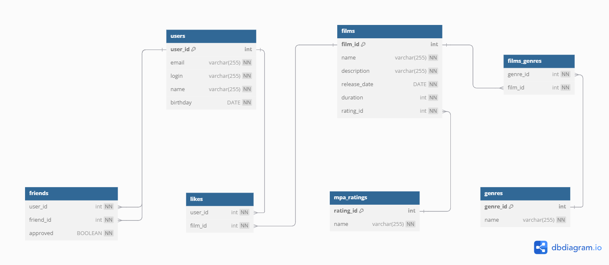

# java-filmorate
## This is the ER diagram of this project

1. _Запрос на получение всех фильмов с рейтингами_
```` 
SELECT film_id,  
f.name AS film_name,  
description,  
release_date,  
duration,  
f.rating_id,  
mr.name AS mpa_name  
FROM films AS f  
JOIN mpa_ratings AS mr ON mr.rating_id = f.rating_id;
````
2. Запрос на получение всех пользователей  
````
SELECT user_id, 
email, 
login, 
name, 
birthday 
FROM users
````


